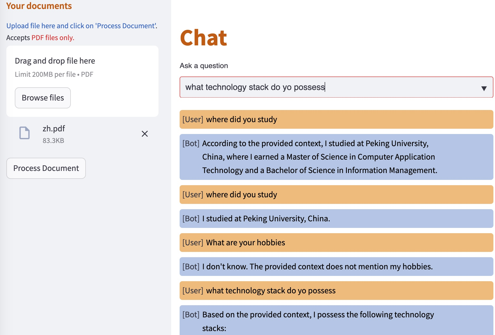

This is a chat bot intended to answer questions based on uploaded files. For example, you can upload resume then ask questions about the resume.

The app is built on top of Langchain, Ollama and Streamlit.

Example UI:


Steps to run
- Install Ollama server locally, and download the Ollama3 model (not Ollama3.2).
- Install Python dependencies by executing ```pip install -r requirements.txt```
- Start the app by executing the following command from the project root directory
```python -m streamlit run app.py --server.port=8501 --server.address=0.0.0.0```
